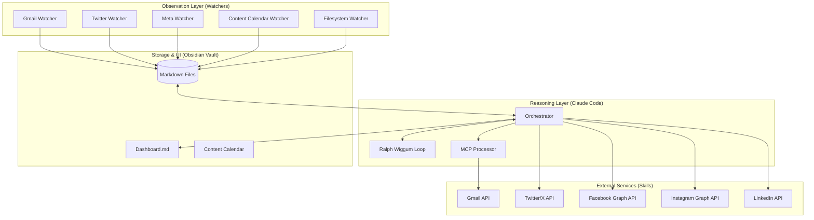

# Gold Tier Completion Report - Personal AI Employee

**Version**: 3.0 (Gold)  
**Date**: April 24, 2026

## 1. System Overview
The **Personal AI Employee (Gold Tier)** is a fully autonomous, multi-platform intelligent automation system. It expands the Silver Tier's capabilities with cross-platform social media integration, advanced error recovery, and a continuous execution loop.

## 2. Architecture Diagram

## 3. Key Gold Tier Features

### 3.1 Autonomous Multi-Platform Posting
*   **Unified Calendar**: A single plan in `Content_Calendar/` drives posts across LinkedIn, Twitter/X, Facebook, and Instagram.
*   **HITL Workflow**: All social posts are staged in `Pending_Approval` for human review before publishing.
*   **Platform Specifics**: Automatic 280-char truncation for Twitter and image URL handling for Instagram.

### 3.2 Resilience & Graceful Degradation
*   **API Down Handling**: System detects transient API errors and automatically queues posts for retry in the next cycle.
*   **Gmail MCP Queuing**: Failed email actions are saved as `QUEUED_MCP_GMAIL_*.json` for autonomous retry.
*   **Vault Lock Management**: Prevents data loss during concurrent access by logging overflow to `/tmp/vault_overflow/`.

### 3.3 Continuous Agent Loop (Ralph Wiggum)
*   **Stop Hook**: Claude Code uses a custom hook to stay active as long as there are pending tasks in `Needs_Action`.
*   **Self-Triggering**: The orchestrator can resume its own execution session if the task backlog exceeds a threshold.

### 3.4 Structured Intelligence
*   **CEO Weekly Briefing**: Automated Monday morning summaries of all cross-platform activity, including anomaly detection.
*   **Comprehensive Audit**: Every external action produces a structured JSON audit trail in `vault/Logs/`.

## 4. Components List

| Component | Purpose |
|-----------|---------|
| `MetaAPIClient` | Wrapper for Facebook and Instagram Graph API |
| `TwitterAPIClient` | Wrapper for Twitter/X API v2 (tweepy) |
| `ContentCalendarWatcher` | Unified monitor for scheduled multi-platform posts |
| `AuditLoggerSkill` | Centralized structured logging for all skills |
| `MCPProcessor` | (Enhanced) Supports filesystem MCP and action queuing |
| `scripts/health_check.py` | Standalone utility to verify system connectivity |

## 5. Lessons Learned & Limitations
*   **Instagram Requirements**: Instagram Business posting requires a public image URL; the system currently uses placeholders which must be replaced by the user during the approval phase if local assets are used.
*   **Rate Limits**: Twitter and Meta have strict rate limits; watchers are tuned to check every 15 minutes to avoid throttling.

---
**Status**: 🏆 Gold Tier Requirements Fulfilled.
